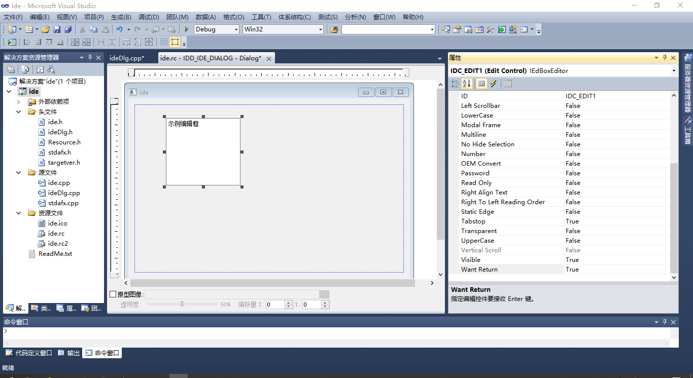
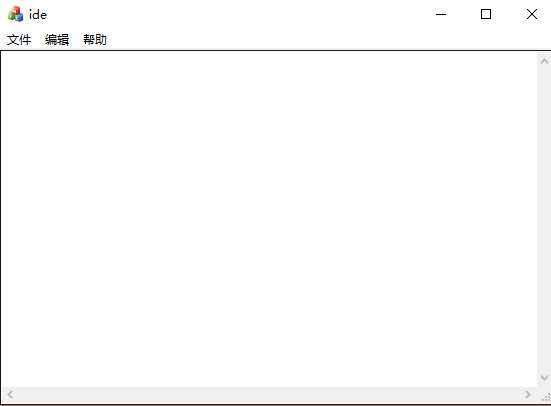

# MFC
## 需要用到的c++基础知识  
### 内存管理机制
c++兼容c的内存管理机制，但如果使用malloc分配的内存就必须要free，用new分配的内存就必须要delete  
c与c++中malloc的使用方法不同：  
```
//c
char *p = malloc(100);
free(p);

//c++比c更严谨
char *p = (char *)malloc(100);//因为malloc的返回类型为void，因此要进行强转
free(p);
```
在c++中更多地使用new分配内存，用new返回的类型就是它相对应得类型：  
```
char *p = new char[100]；//在堆中分配100个char的内存
delete p; //释放了1个char，释放不完全
delete []p; //释放一个数组p
char *p1 = new char; //在堆中分配1个char的内存
```
c中不能有同名的函数，c++中可以同名，参数不同即可：  
```
void test(int a=10)//a为缺省参数，默认为10
{
  printf("a=%d\n", a);
}

void test(int a, int b)
{
  printf("a=%d\nb=%d\n", a,b);
}

int main()
{
  test();//结果a=10
  test(1);//结果a=1
  test(1,2)//结果a=1，b=2
}
```
### 构造函数
[c++示例代码](file1.cpp)  
在上述代码，结构体本来是栈里面的变量，如果想放在堆中，需要对main函数进行以下修改：  
```
int main()
{
	man *m = new man;
	m->set_name("tom");
	m->set_age(20);
	printf("%s,%d\n",m->get_name(),m->get_age());
  delete m;
	return 0;
}
```
构造函数：只要在结构体中定义了就一定会被调用  
构造函数的特点：没有返回值，名字和结构体名字相同  
下列代码中的man（）即为构造函数,在main函数中并没有写m.man()但是还是会被调用，输出“hello world”,在m被创建的时候就调用，先输出hello world再输出tom 20  
构造函数的重载：下列代码中的man(const char xp)即为构造函数的重载
```
#include <stdio.h>
#include <string.h>

struct man
{
	char name[20];//只是一个结构并不会在内存中出现，知道m被创建时才会在内存中出现，是堆还是栈取决于m创建的方式
	int age;
	void set_name(const char *p)
	{
		strcpy(name, p);
	}
	void set_age(int a)
	{
		age = a;
	}
	const char *get_name()
	{
		return name;
	}
	int get_age()
	{
		return age;
	}
  man() //构造函数
  {
    printf("hello world");
  }
  man(const char *p， int a = 0) //构造函数的重载
  {
    age = a；
    strcpy(name,p);
  }
};

int main()
{
	man *m = new man; //这里结构体是堆里面的变量
	m->set_name("tom");
	m->set_age(20);
	printf("%s,%d\n",m->get_name(),m->get_age());
  delete m;
  
  man m1;//这里结构体是栈里面的变量，这里调用的是构造函数man()
  
  man m2("abc"); //这里调用的是构造函数man(const char *p)
  printf(“%s.%d\n”,m2.get_name(),m2.get_age());//输出age为0
  
  man m3("efg"，100);
  printf(“%s.%d\n”,m3.get_name(),m3.get_age());//输出age为100
  
  man *m4 = new man("lily",30);
  printf("%s,%d\n",m4->get_name(),m4->get_age());
  delete m3;
  
	return 0;
}
```
### 析构函数
构造函数在内存中出现时被自动调用，在内存中销毁时会自动调用析构函数  
构造函数可以有多个，但析构函数只能有一个且没有参数  
```
//文件名：file2
//作  者：lccate
//时  间：2019.6
//描  述：析构函数

#include <stdio.h>
#include <string.h>

struct A
{
	int age;
	A(int a)
	{
		age = a;
		printf("A,%d\n", age);
	}

	~A()
	{
		printf("~A,%d\n",age);
	}
};

int main()
{
	A a(10);
	A *p = new A(20);
	delete p;

	return 0;
}
```
上述代码的输出结果如下，注意输出的顺序：  
```
A,10
A,20
~A,20
~A,10
```

### 如何在调用main函数之前就执行一段代码？
```
#include <stdio.h>

struct A
{
	A()
	{
		int a;
		scanf("%d", &a);
		int b;
		scanf("%d", &b);
		printf("%d\n", a+b);
	}
};

A a; //程序的入口变成了某一个类的成员函数或构造函数，但是实际上一般不这样写

int main()
{
	return 0;
}
```
### this指针  
this是c++的关键字代表对象的地址  
如果同名用来解决赋值的问题  
```
//文件名：file3
//作  者：lccate
//时  间：2019.6
//描  述：

#include <stdio.h>

struct A
{
	A()
	{

	}
	int age;
	void set_age(int age)
	{
		this->age = age;//this->age表示结构中的age（int age）,等号右边的age表示参数age
	}
	struct A *get_addr()
	{
		return this;
	}
};

int main()
{
	A a;// a是一个对象
	printf("%p,%p\n",&a,a.get_addr());
	A *p = new A;
	printf("%p,%p\n",&p, p->get_addr());
	delete p;
	return 0;
}
```
### 类与结构体的区别
```
#include <stdio.h>
#include <string.h>

struct man
{
	char *name;
	int age;


	void set_name(const char *name)
	{
		this->name = new char[strlen(name)+1];
		strcpy(this->name, name);
	}

	const char *get_name()
	{
		return name;
	}

	~man()
	{
		delete []name;
	}
};

int main()
{
	man m;
	m.set_name("dqwwbfiuqbeoifcboqri");
	//m.set_name("aa");//如果加上这一句编译不出错但是实际会导致内存泄漏
	printf("%s\n", m.get_name());
	return 0;
}
```
改进版：  
```
//文件名：file4
//作  者：lccate
//时  间：2019.6
//描  述：

#include <stdio.h>
#include <string.h>

struct man
{
	char *name;
	int age;

	man()
	{
		name = NULL;
	}

	void set_name(const char *name)
	{
		if(name)
			delete []this->name;
		this->name = new char[strlen(name)+1];
		strcpy(this->name, name);
	}

	const char *get_name()
	{
		if (name)
			return name;
		else
			return "nothing";
	}

	~man()
	{
		if (name)
			delete []name;
	}
};

int main()
{
	man m;
	m.set_name("dqwwbfiuqbeoifcboqri");
	m.set_name("aa");//如果加上这一句编译不出错但是实际会导致内存泄漏
	printf("%s\n", m.get_name());
	return 0;
}
```
将上述代码结构体转化为类：  
```
#include <stdio.h>
#include <string.h>

class man
{
public:
	char *name;
	int age;

	man()
	{
		name = NULL;
	}

	void set_name(const char *name)
	{
		if(name)
			delete []this->name;
		this->name = new char[strlen(name)+1];
		strcpy(this->name, name);
	}

	const char *get_name()
	{
		if (name)
			return name;
		else
			return "nothing";
	}

	int get_age() //公有方法get_age
	{
		return age;
	}

	~man()
	{
		if (name)
			delete []name;
	}
private:
	int age;
};

int main()
{
	man m;
	m.set_name("dqwwbfiuqbeoifcboqri");
	m.set_name("aa");//如果加上这一句编译不出错但是实际会导致内存泄漏
	printf("%s\n", m.get_name());
	//printf("%d\n", m.age);//age为私有成员，在类外不可访问,但是在类中public部分增加了公有方法get_age后就可以访问到

	return 0;
}
```
在c++中，结构体的所有成员都是公有的，外部可以访问，但是类（class）中的所有成员都是私有的，外部不能访问，如果要外部能访问，需要标识public  
上述代码中，age为私有成员，在类外不可访问,但是在类中public部分增加了公有方法get_age后就可以访问到（python中也有类似的地方）  
```
#include <stdio.h>
#include <string.h>

class man
{
private:
	char *name;
	int age;
public:
	man()
	{
		name = NULL; //c++中，一般会在类的内部进行初始化
		age = 0;
	}

	~man()
	{
		if(name)
			delete []name;
	}

	const char *get_name()
	{
		return name;
	}

	int get_age()
	{
		return age;
	}

	void set_name(const char *name)
	{
		if(strcmp(name,"张三")==0) //在public中增加了限制条件，就能够限制用户的输入，增强代码的健壮性
			return;
		if(this->name)
			delete []this->name;
		this->name = new char[strlen(name)+1];
		strcpy(this->name, name);
	}

	void set_age(int age)
	{
		this->age = age;
	}
};

int main()
{
	man m;
	char name[100];
	scanf("%s",name);
	int age = 0;
	scanf("%d",&age);
	m.set_name(name);
	m.set_age(age);
	printf("%s, %d\n", m.get_age(), m.get_name());
	return 0;
}
```
为什么要采用类public、private这种方式编写代码？c++的特点，使代码具有健壮性  
类的继承：与python道理一样  
## 一个简单的MFC例子  
### 基本流程
新建MFC应用程序，从工具箱往面板上放置button，并双击编写相应的代码，在属性栏中可以修改属性  
```
void Cmfc_demoDlg::OnBnClickedButton1()
{
	// TODO: 在此添加控件通知处理程序代码
	UpdateData(TRUE);//把用户在控件里面输入的值和变量对应起来
	c = a+b;
	UpdateData(FALSE);//显示变量c的值
}
```
修改属性中的Disabled为True，则按钮变灰，无法使用，但是可以对按钮进行破解  
### 破解按钮 
windows的窗口都有句柄，窗口里的控件也一样有句柄，打开vs的工具spy++的望远镜进行刺探  
小插曲：  
1 [关闭MFC项目后再次打开找不到按钮视图解决方法](https://blog.csdn.net/wzg31796/article/details/51531279)  
2 选择窗口-重置窗口布局，即可恢复默认的窗口布局  
由spy++得到按钮句柄为000B06E0（16进制），给此句柄发送一个鼠标左键按下抬起的消息  
```
#include <windows.h>

int main()
{
	Sleep(3000);//3s延迟
	SendMessage((HWND)0x001A06D6, WM_LBUTTONDOWN,0,0);//向指定句柄发送一个鼠标按下的消息
	SendMessage((HWND)0x001A06D6, WM_LBUTTONUP,0,0);//鼠标抬起
	return 0;
}
```
### MFC版的ide
1 创建名为ide的MFC，插入编辑框并删除多余的按钮，修改编辑框的multiline为true，want return属性为true（可以输入多行数据）  
  
2 增加滚动条，将vertical scroll和horizotal scroll都改为true  
3 令编辑框和窗口一起变大变小：选中编辑框添加变量，类别为control，在cpp文件中添加代码  
```
	else
	{
		CRect rect;
		GetClientRect(&rect);
		edit1.SetWindowPos(NULL, 0 ,0,rect.Width(),rect.Height(),0);
		CDialogEx::OnPaint();
	}
}
```
4 添加菜单：在资源文件中添加资源，添加menu，更改对话框属性Menu  
  
5 接下来对菜单栏的功能进行补充  
文件-退出：退出右键，添加事件处理程序，类列表选择idedlg，在生成的构架下添加代码  
  
```
void CideDlg::On32779()//退出菜单的对应执行函数
{
	// TODO: 在此添加命令处理程序代码
	CDialogEx::OnCancel();
}
```
帮助-关于：步骤同上，添加代码  
  
```

void CideDlg::On32783()
{
	// TODO: 在此添加命令处理程序代码
	CAboutDlg dlgAbout;
	dlgAbout.DoModal();
}
```
文件-打开：步骤同上，添加代码完成以下功能：打开文件夹；判断是确定还是取消；读入文件内容；读入文件内容时显示换行内容  
```
void CideDlg::On32777()
{
	// TODO: 在此添加命令处理程序代码
	CFileDialog cf(TRUE);//MFC提供的一个类，功能是弹出一个文件打开对话框
	if(cf.DoModal() == IDOK)//判断用户打开文件时按下的是确定
	{
		CString cs;//MFC提供的字符串类
		//需要把宽码格式的字符串转化为GBK格式的字符串
		cs = cf.GetPathName();
		MessageBox(cs);//弹出一个对话框，对话框里显示这个字符串
		CStringA file_name(cs);//调用cstringA的构造函数将宽码字符串转化为ascii码字符串，ASCII码也是gbk格式的
		FILE *p = fopen(file_name.GetBuffer(), "r");
		CStringA content;//存放文件内容
		if (p)
		{
			while(!feof(p))
			{
				char buf[1024] = {0};
				fgets(buf,sizeof(buf),p);//读一行  
				content += buf;//字符串追加
				content += "\r\n";
			}
			fclose(p);
			CString con;
			con = content;//转化宽码
			edit1.SetWindowText(con);
		}
	}
	//如果是取消则什么都不做
}
```
文件-保存：与文件打开类似  
```
void CideDlg::On32778()
{
	// TODO: 在此添加命令处理程序代码
		CFileDialog cf(FALSE);//MFC提供的一个类，功能是弹出一个文件保存对话框
	if(cf.DoModal() == IDOK)//判断用户打开文件时按下的是确定
	{
		CString cs;//MFC提供的字符串类
		//需要把宽码格式的字符串转化为GBK格式的字符串
		cs = cf.GetPathName();
		//MessageBox(cs);//弹出一个对话框，对话框里显示这个字符串
		CString con;

		edit1.GetWindowText(con);//将用户在edit中输入的内容放入变量con
		CStringA content(con);
		CStringA file_name(cs);
		FILE *p = fopen(file_name.GetBuffer(),"w");
		fputs(content.GetBuffer(),p);
		fclose(p);
	}
}
```
编辑-拷贝：  
```
void CideDlg::On32780()
{
	// TODO: 在此添加命令处理程序代码
	edit1.Copy();
}
```
编辑-粘贴：  
```
void CideDlg::On32785()
{
	// TODO: 在此添加命令处理程序代码
	edit1.Paste();
}
```
编辑-剪切：  
```
void CideDlg::On32781()
{
	// TODO: 在此添加命令处理程序代码
	edit1.Cut();
}
```


